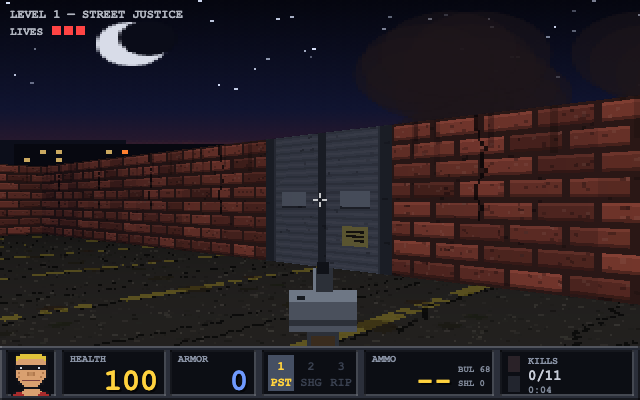

# DUKE REDUX

An original retro FPS homage to the king of one-liners — a 90s Build-engine-style
raycaster written from scratch in vanilla JavaScript. One HTML file, one JS file,
zero dependencies, zero downloaded assets: every texture, sprite, and sound is
generated procedurally at startup.

## ▶ Play it online — free, no install

### 👉 **[duke-nuken-redux.vercel.app](https://duke-nuken-redux.vercel.app/)** 👈

<a href="https://duke-nuken-redux.vercel.app/" target="_blank" rel="noopener noreferrer"><strong>► CLICK HERE TO COME GET SOME ◄</strong></a>

Runs in any modern browser on **desktop _and_ mobile** — phones and tablets get an
on-screen joystick + fire button automatically. Best with the **sound on**. 🔊

  

## Run it locally

Open `index.html` in any modern browser. That's it. (Or `python3 -m http.server`
and visit `localhost:8000` if you prefer.)

## Controls

| Input | Action |
|---|---|
| Click | Lock mouse / fire |
| WASD | Move / strafe |
| Mouse | Look |
| E / Space | Open doors, hit exit switches |
| 1 / 2 / 3 (or wheel) | Pistol / Shotgun / Ripper |
| Shift | Run |
| Tab (hold) | Map |
| M | Toggle music |
| V | Toggle voice one-liners (deep, gravelly synth growl) |
| Esc | Pause (release mouse) |

**On mobile / touch devices**, an on-screen **left joystick** (move & turn) and a
**FIRE button** (shoot + open doors) appear automatically — tap the screen or FIRE to
start and advance menus.

## The campaign

1. **STREET JUSTICE** — the aliens torched the strip. Pistol start; find the shotgun.
2. **SEWER PURGE** — drones, a chaingun, and a red keycard behind an Enforcer.
3. **MOTHERSHIP** — grab the blue keycard, open the bulkhead, and take down the **OVERLORD**.
4. **REACTOR CORE** — an industrial swarm with a roaming Overlord and a red-keycard exit.
5. **TOXIC WARRENS** — a divided hellhole; the Overlord guards the exit behind a blue lock.
6. **HIVE THRONE** — two chained keycard gates and **twin Overlords** on the dais. Good luck.

You get **3 lives**; run out and it's GAME OVER (back to the title for a fresh run).
Each level starts you at full health with a small ammo resupply — your weapons, armor
and remaining ammo carry over, and difficulty climbs each stage. The pistol never runs
dry, so every level stays beatable even if you burn through shells and bullets.

## Engine notes

- Grid-based DDA raycaster, 320 columns, textured walls with distance fog
- Per-pixel textured floor & ceiling casting (Build-engine style)
- Parallax night-sky skybox with a burning, procedurally-built city skyline
- Animated wall textures: scrolling computer screens, pulsing alien flesh, blinking exit signs
- Wolf3D-style sliding doors (incl. keycard-locked) with pneumatic open/close audio
- Z-buffered billboard sprites with 4-level distance shading (sector-lighting feel)
- Multi-frame sprite animation: 4-step walk cycles, fire/pain/death/corpse frames
- Additive-blended plasma bolts, muzzle flashes, sparks, and gib particles
- Animated weapon viewmodels: pistol slide, shotgun pump action, spinning ripper barrels
- Reactive HUD mugshot (grins on pickups/kills, grimaces on hits, bloodies as HP drops)
- Enemy AI: alert/chase/strafe-wiggle/windup-attack, hitscan + projectile types
- All-synthesized WebAudio: layered gun reports with mechanical follow-through,
  pig-style squeals per enemy, pneumatic doors, footsteps, per-level ambient beds
  with random events (distant booms, sewer drips, ship throb), and a
  kick/snare/hat/bass/power-chord grunge loop
- One-liners spoken via the browser's built-in speech synthesis (toggle with V)

All art, levels, names, and one-liners are original — homage, not asset rips.
